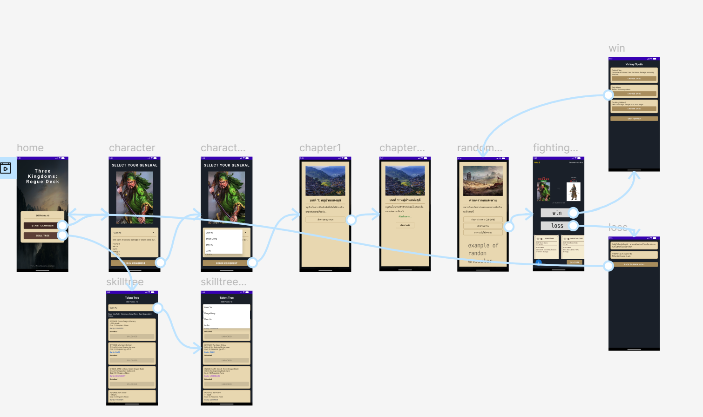

# Three Kingdoms Deck Rogue (Android Narrative Update)

A narrative-driven roguelike deck-building card game for Android.

## 🌟 New & Updated Features
### 📖 Narrative & Story System
* **Chapter-Based Progression:** Experience the story through Chapters (Intro/Epilogue).
* **Dynamic Story Events:** Spare or Execute bosses after battle.
* **Random Encounters:** 70% Military encounters / 30% World events.
* **Integrated Shop System:** Mid-run upgrades via traveling merchants.

### ⚔
️ Battle & Meta-Progression
* **Turn-based Combat:** Energy, HP, Block, and Hand management.
* **Famous Generals:** Cards like Guan Yu, Zhang Fei, and Lu Bu.
* **Meta-Progression:** Earn Skill Points to unlock permanent upgrades.
* **Permadeath:** Run resets on HP 0.

## 📂 Project Structure
* `model/`: Game data (Card, StoryEvent).
* `game/`: Core logic (GameSession, ShopLibrary).
* `ui/`: Activities (Battle, Story, Selection).

## 😈 wireframe
* https://www.figma.com/design/1bonwYEtQA5oMNXCpE46ZU/Untitled?node-id=0-1&t=nHSwcHtiIFhFxcbq-1
* 

## 🚀 Getting Started
1. Clone the repository.
2. Open in Android Studio (Ladybug or newer).
3. Place story images (e.g., `village.png`) in `app/src/main/res/drawable/`.
4. Run on API 24+ (Android 7.0).
## 🚀 Getting Started
1. Clone the repository.
2. Open in Android Studio (Ladybug or newer).
3. Place story images (e.g., `village.png`) in `app/src/main/res/drawable/`.
4. Run on API 24+ (Android 7.0).
